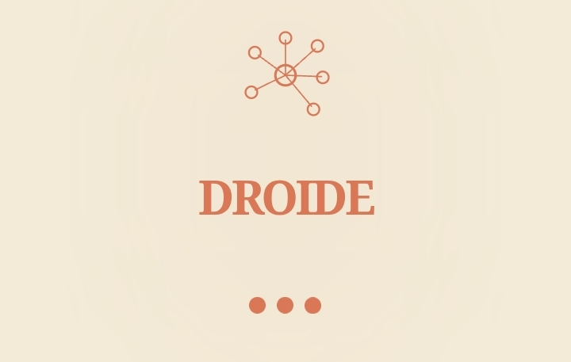
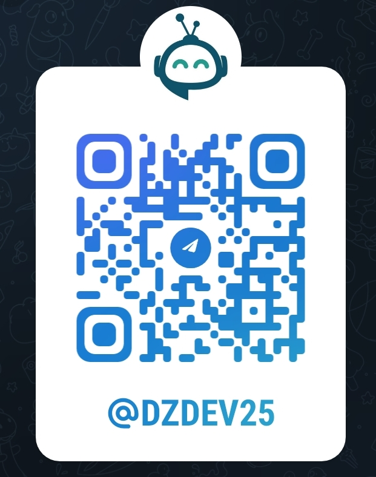

<div align="center">



# 🤖 Droide — Advanced AI Assistant

**Modern • Mobile-First • Multi-Provider • Agentic**

[](https://github.com/yourusername/droid-apk/actions/workflows/build-apk.yml)


> A fully-featured, native-grade AI assistant app powered by Google Gemini and any OpenAI-compatible API. Built with React + TypeScript + Vite, packaged as a native Android APK via Capacitor — with agentic tools, memory, skills, code execution, artifacts, and much more.

</div>

---

## 📋 Table of Contents

- [Overview](#-overview)
- [Features](#-features)
  - [Core Chat](#-core-chat)
  - [Agentic Tools](#-agentic-tools)
  - [Artifacts & Code](#-artifacts--code)
  - [AI & Model Settings](#-ai--model-settings)
  - [Memory & Personalization](#-memory--personalization)
  - [Skills & Extensions (MCP)](#-skills--extensions-mcp)
  - [UI/UX & Accessibility](#-uiux--accessibility)
  - [Native Android Features](#-native-android-features)
  - [Data & Privacy](#-data--privacy)
- [Tech Stack](#-tech-stack)
- [Prerequisites](#-prerequisites)
- [Installation & Local Setup](#-installation--local-setup)
- [Building the APK](#-building-the-apk)
  - [Method 1 — GitHub Actions (Recommended)](#method-1--github-actions-recommended-zero-setup)
  - [Method 2 — Local Build](#method-2--local-build-full-control)
- [Configuration](#-configuration)
- [Project Structure](#-project-structure)
- [Future Roadmap](#-future-roadmap)
- [Community & Updates](#-community--updates)

---

## 🌟 Overview

**Droide** is a next-generation AI assistant built for people who want the power of LLMs in a beautiful, fast, and truly capable mobile app. It goes far beyond a simple chat wrapper:

- 🔗 Connect to **any AI provider** — Gemini, OpenAI, OpenRouter, Ollama, or any custom OpenAI-compatible endpoint
- 🛠️ True **agentic capabilities** — execute code, search the web, generate images, fetch weather, browse URLs, manage files, and more
- 🧠 **Persistent memory** — the AI learns and remembers facts about you across sessions
- 📦 **Skills & MCP marketplace** — install hundreds of Model Context Protocol extensions
- 📱 **Native Android APK** — compiled with Capacitor for a smooth, native feel
- 🎨 **Artifacts** — render live interactive HTML, SVG, and Mermaid diagrams inline in chat

---

## ✨ Features

### 💬 Core Chat

| Feature | Description |
|---|---|
| **Multi-session Management** | Create, rename, pin, archive, and delete unlimited chat sessions |
| **Folder Organization** | Group sessions into custom folders for project-based workflows |
| **Project Workspaces** | Dedicated project contexts with separate settings and history |
| **Streaming Responses** | Real-time token streaming with a live typing cursor indicator |
| **Message Editing** | Edit any previously sent message; full edit history is preserved |
| **Regenerate Response** | Re-roll any assistant message with one tap |
| **Message Deletion** | Delete individual messages from anywhere in the conversation |
| **Copy & Share** | Copy raw text or share formatted messages via the native share sheet |
| **Auto-Title Generation** | Sessions are automatically titled based on conversation content |
| **Pinned Sessions** | Pin your most important chats to the top of the sidebar |
| **Archiving** | Archive old sessions to keep the sidebar clean without losing history |
| **Thinking Indicator** | Animated "Thinking..." indicator with elapsed time counter |
| **Scroll-to-Bottom FAB** | Floating button to instantly jump to the latest message |
| **Word / Token Counter** | Real-time word and token count for the input field |

---

### 🛠️ Agentic Tools

Droide uses Google Gemini's native function-calling API to execute real tools — not simulated responses:

| Tool | Capability |
|---|---|
| `googleSearch` | Live internet search via Google Search grounding |
| `execute_code` | Run sandboxed code in Python, JavaScript, TypeScript, Rust, Go, C, C++, Bash |
| `generate_image` | Generate images from text prompts |
| `get_weather` | Real-time weather via Open-Meteo API (lat/lon based) |
| `search_places` | Maps & places search powered by OpenStreetMap / Nominatim |
| `get_sports_data` | Live sports scores and standings (NBA, NFL, MLB, NHL, EPL, MLS) via ESPN |
| `read_url_content` | Fetch and read full web page content via proxy (deep research) |
| `save_file` | Save Markdown, text, CSV, or code files to local session storage |
| `manage_memory` | Learn or forget facts about the user for persistent personalization |
| `clear_chat_history` | Programmatically clear the current session |
| `get_current_time` | Get the current date and time in the user's timezone |
| `update_app_settings` | Dynamically change theme, font size, and other settings via chat |
| `save_prompt` | Save new personas and prompts to the Prompt Library via chat |
| `install_skill` | Install new skills and integrations directly through conversation |

> **Tool Access Modes**: Choose between `needed` (auto), `always`, or `never` in Settings → Capabilities.

---

### 🎨 Artifacts & Code

- **HTML Artifacts** — The AI can generate full interactive HTML + Tailwind CSS pages rendered live inside a sandboxed iframe in chat
- **SVG Illustrations** — Inline vector graphics rendered directly in the message
- **Mermaid Diagrams** — Flowcharts, sequence diagrams, class diagrams, ER diagrams rendered from Markdown
- **AI-Powered Artifacts** — Artifacts can themselves call the Gemini API for interactive AI-driven mini-apps
- **Syntax-Highlighted Code Blocks** — All code blocks use `react-syntax-highlighter` with line numbers and a copy button
- **Code Execution** — Run code blocks directly from the chat with one tap via the Piston API sandbox
- **Artifact Viewer** — Dedicated full-screen artifact viewer with zoom and share controls

---

### 🧠 AI & Model Settings

- **Google Gemini** — Primary AI provider with full streaming, function calling, and vision support
- **Custom API Providers** — Add any OpenAI-compatible endpoint (OpenRouter, Ollama, LM Studio, Together AI, etc.) with name, base URL, and API key
- **Model Selector** — Switch between models mid-conversation; auto-fetches available models from custom providers
- **Temperature Control** — Adjust response creativity (0.0 – 2.0)
- **Top-P Control** — Fine-tune token probability sampling
- **Personas** — Switch between built-in personas: Droide (default), Coder, Writer, Tutor — or create your own
- **Adaptive Thinking** — Toggle a multi-step cognitive framework that makes the AI pivot perspectives, challenge assumptions, and reflect on its reasoning
- **System Prompt Editor** — Full custom system prompt with live character count
- **Custom Instructions** — Persistent custom instructions appended to every conversation
- **Formatting Preferences** — Control prose style (concise / detailed / narrative), list style, and response length
- **Writing Style** — Set a global writing style preference
- **Censored Mode** — Per-model content safety toggle
- **Stream Responses** — Toggle real-time streaming on or off

---

### 🧩 Memory & Personalization

- **Persistent Memory** — The AI uses `manage_memory` to remember facts about you (name, preferences, work context) across all sessions stored in IndexedDB
- **Memory Manager UI** — View, search, and delete all stored memories from the Memory Menu
- **User Profile** — Set your full name, nickname, avatar, and work description; used to personalize responses
- **Bengali Language Mode** — `forceBengali` setting instructs the AI to always respond in Bengali
- **Chat Font & Font Size** — Choose from a curated list of fonts and set a custom font size
- **Caret / Cursor Style** — Customize the text cursor style: bar, underscore, block, dot, or slash
- **Theme** — Light, Dark, or System (follows device preference)

---

### 🔌 Skills & Extensions (MCP)

- **Extension Marketplace** — Browse and install hundreds of curated MCP (Model Context Protocol) server integrations
- **Categories** — Developer Tools, Databases, Cloud Providers, Productivity, Communication, Finance, Analytics, Security, AI & ML, E-commerce, CRM, Design, DevOps, and more
- **Community MCPs** — Live GitHub search fetches the latest community-built MCP servers sorted by stars
- **Custom MCP** — Add any custom MCP server by URL or GitHub repository link
- **Prompt Library** — Save, browse, and apply custom personas and system prompts
- **Installed Skills List** — View all installed skills with name, description, and install date

---

### 📱 UI/UX & Accessibility

- **Mobile-First Design** — Designed from scratch for small screens with native-grade touch targets
- **Framer Motion Animations** — Smooth entrance/exit animations throughout the entire app
- **Animated Thinking Cursor** — Character-by-character wave animation during AI thinking
- **Haptic Feedback** — Native vibration on key interactions (Android)
- **Voice Dictation** — Speech-to-text input via the Web Speech API
- **Vision / Image Upload** — Attach images to messages; full multimodal support (JPEG, PNG, WebP, GIF, video, audio)
- **File Attachment** — Attach and share files (archives auto-extracted), with a rich file type icon registry
- **Format Toolbar** — Quick shortcuts for bold, italic, code, and other Markdown formatting
- **Skeleton Loaders** — Smooth skeleton loading states for sessions and messages
- **Toast Notifications** — Non-intrusive feedback toasts for actions and errors
- **Task Completion Notifications** — In-app and sound notification when a long-running task finishes

---

### 🤖 Native Android Features

- **Capacitor Integration** — Web app wrapped as a native Android APK using Capacitor v8
- **Splash Screen** — Custom branded splash screen with immersive full-screen mode
- **Status Bar** — Themed status bar matching the app color
- **Keyboard Handling** — Native keyboard show/hide events handled via `@capacitor/keyboard`
- **App ID** — `com.droide.app`
- **GitHub Actions CI** — Automated APK build on every push to `main`

---

### 🔒 Data & Privacy

- **Local-First Storage** — All sessions, settings, and memories are stored locally in the browser's `localStorage` and `IndexedDB` — no account required
- **Data Export** — Export all your chat data and settings as a JSON file
- **Shared Chats** — Manage and delete any shared conversation links
- **Location Metadata** — Optional toggle to include location context in AI prompts
- **Network Egress Control** — Toggle whether agentic tools can make outbound network requests
- **Censored Mode** — Per-model safety filter toggle
- **Privacy Settings Tab** — Dedicated privacy section in Settings with granular controls

---

## 🔧 Tech Stack

| Layer | Technology |
|---|---|
| **Frontend Framework** | React 19 + TypeScript |
| **Build Tool** | Vite 6 |
| **Styling** | Tailwind CSS v4 |
| **Animation** | Framer Motion (motion/react) |
| **AI SDK** | `@google/genai` v2 |
| **Markdown Rendering** | `react-markdown` + `remark-gfm` |
| **Code Highlighting** | `react-syntax-highlighter` |
| **PDF Export** | `jspdf` |
| **ZIP Handling** | `jszip` |
| **Local Database** | IndexedDB via `idb` |
| **Icons** | `lucide-react` |
| **Server** | Express + `tsx` (dev proxy for Gemini API) |
| **Native Wrapper** | Capacitor v8 (Android + iOS) |
| **CI/CD** | GitHub Actions |

---

## 📦 Prerequisites

Before you begin, make sure you have the following installed:

- **Node.js** v22 or higher — [nodejs.org](https://nodejs.org)
- **npm** v10 or higher (comes with Node.js)
- **Git** — [git-scm.com](https://git-scm.com)
- **Google Gemini API Key** — [Get one free at Google AI Studio](https://aistudio.google.com/app/apikey)

**For building the Android APK locally (optional):**
- **Java JDK 21** (Zulu or OpenJDK) — [Adoptium](https://adoptium.net)
- **Android Studio** (for SDK tools) — [developer.android.com](https://developer.android.com/studio)
- **Android SDK** with Build Tools 34+

---

## 🚀 Installation & Local Setup

### 1. Clone the repository

```bash
git clone https://github.com/yourusername/droid-apk.git
cd droid-apk
```

### 2. Install dependencies

```bash
npm install
```

### 3. Configure your API key

```bash
cp .env.example .env.local
```

Open `.env.local` and add your Gemini API key:

```env
GEMINI_API_KEY=your_gemini_api_key_here
APP_URL=http://localhost:3000
```

### 4. Run the development server

```bash
npm run dev
```

The app will be available at **http://localhost:3000**

> The dev server runs an Express proxy (`server.ts`) that forwards Gemini API requests through the backend to avoid browser CORS restrictions.

### 5. Build for production (web)

```bash
npm run build
```

The production build will be output to the `dist/` folder.

---

## 📱 Building the APK

Droide uses **Capacitor** to package the web app as a native Android APK. There are two methods:

---

### Method 1 — GitHub Actions (Recommended, Zero Setup)

The repository includes a pre-configured GitHub Actions workflow that automatically builds a debug APK on every push to `main`. No local Android environment required.

**Steps:**

1. **Fork or push** this repository to your GitHub account.

2. **Add your Gemini API key** as a GitHub repository secret:
   - Go to `Settings` → `Secrets and variables` → `Actions` → `New repository secret`
   - Name: `GEMINI_API_KEY`
   - Value: your API key

3. **Push to `main`** (or trigger manually via `Actions` → `Build Android APK` → `Run workflow`).

4. **Download the APK:**
   - Go to `Actions` → Select the latest workflow run
   - Download the **`Droide-App-APK`** artifact
   - Install `app-debug.apk` on your Android device (enable "Install from unknown sources" in settings)

> The workflow file is at `.github/workflows/build-apk.yml`

---

### Method 2 — Local Build (Full Control)

#### Step 1 — Build the web app

```bash
npm run build
```

#### Step 2 — Add Android platform

```bash
npx cap add android
```

#### Step 3 — Sync web assets to Android

```bash
npx cap copy android
```

#### Step 4 — Fix Kotlin dependency conflicts (one-time)

Append the following to `android/app/build.gradle`:

```gradle
configurations.all {
    resolutionStrategy {
        force 'org.jetbrains.kotlin:kotlin-stdlib:1.8.22'
        force 'org.jetbrains.kotlin:kotlin-stdlib-common:1.8.22'
    }
    exclude group: 'org.jetbrains.kotlin', module: 'kotlin-stdlib-jdk7'
    exclude group: 'org.jetbrains.kotlin', module: 'kotlin-stdlib-jdk8'
}
```

#### Step 5 — Set up JDK 21

Make sure `JAVA_HOME` points to JDK 21:

```bash
export JAVA_HOME=/path/to/jdk-21
```

#### Step 6 — Build the debug APK

```bash
cd android
chmod +x gradlew
./gradlew assembleDebug
```

The APK will be at:
```
android/app/build/outputs/apk/debug/app-debug.apk
```

#### Step 7 — (Optional) Open in Android Studio

```bash
npx cap open android
```

This opens the project in Android Studio for signing, debugging, and generating a release APK.

---

#### Building a Signed Release APK

For publishing to Google Play or distributing outside debug mode:

```bash
# Generate a keystore (one-time)
keytool -genkey -v -keystore droide-release.jks \
  -keyalg RSA -keysize 2048 -validity 10000 -alias droide

# In Android Studio:
# Build → Generate Signed Bundle / APK → APK → select keystore → Release
```

---

## ⚙️ Configuration

### `capacitor.config.ts`

```typescript
const config: CapacitorConfig = {
  appId: 'com.droide.app',        // Android package name
  appName: 'Droide',              // Display name on device
  webDir: 'dist',                 // Vite build output folder
  plugins: {
    SplashScreen: { ... },        // Splash screen config
    StatusBar: { ... }            // Status bar color/style
  }
};
```

### Environment Variables (`.env.local`)

| Variable | Required | Description |
|---|---|---|
| `GEMINI_API_KEY` | ✅ Yes | Your Google Gemini API key |
| `APP_URL` | Optional | Base URL of the deployed app |

### In-App Settings

All settings are configured directly in the app's Settings panel (tap the ⚙️ icon):

- **General** — Theme, font, font size, language, caret style, user profile
- **Privacy** — Memory, location metadata, data sharing, network egress
- **Capabilities** — Artifacts, code execution, tool access mode, AI artifacts, inline visualizations
- **Connectors** — Custom API providers and MCP server configurations

---

## 📁 Project Structure

```
droid-apk/
├── .github/
│   └── workflows/
│       └── build-apk.yml          # GitHub Actions APK build pipeline
├── assets/
│   └── telegram-qr.jpg            # Telegram community QR code
├── public/
│   ├── icon.svg                   # App icon
│   └── manifest.json              # PWA manifest
├── src/
│   ├── App.tsx                    # Main app component (core logic)
│   ├── main.tsx                   # React entry point
│   ├── index.css                  # Global styles & CSS variables
│   ├── types.ts                   # TypeScript type definitions
│   ├── components/
│   │   ├── ArtifactViewer.tsx     # Inline artifact renderer (HTML/SVG/Mermaid)
│   │   ├── CodeBlock.tsx          # Syntax-highlighted code with run button
│   │   ├── MemoryMenu.tsx         # Persistent memory manager UI
│   │   ├── SkillsMenu.tsx         # Skills/extensions browser UI
│   │   ├── chat/
│   │   │   ├── BrandLogo.tsx      # Droide brand logo component
│   │   │   ├── ChatHeader.tsx     # Top navigation bar
│   │   │   └── ChatInput.tsx      # Message input with format toolbar
│   │   ├── common/
│   │   │   ├── ScrollToBottomFAB.tsx
│   │   │   └── Skeleton.tsx       # Skeleton loading components
│   │   └── modals/
│   │       ├── DeleteSessionModal.tsx
│   │       ├── ExtensionMarketplace.tsx   # MCP server marketplace
│   │       ├── ModelSelector.tsx
│   │       ├── ProjectWorkspaceModal.tsx
│   │       ├── PromptLibraryModal.tsx
│   │       └── SettingsModal.tsx
│   ├── constants/
│   │   └── fonts.ts               # Curated font list
│   ├── data/
│   │   └── mcpServers.ts          # Built-in MCP server catalog
│   ├── lib/
│   │   ├── archive.ts             # ZIP/archive extraction utilities
│   │   ├── db.ts                  # IndexedDB manager via idb
│   │   ├── fileIconRegistry.tsx   # File type → icon mapping
│   │   └── subagents.ts           # Sub-agent definitions
│   └── services/
│       └── gemini.ts              # Gemini API service, tools, streaming
├── server.ts                      # Express dev server / Gemini API proxy
├── capacitor.config.ts            # Capacitor native app config
├── vite.config.ts                 # Vite build configuration
├── tsconfig.json                  # TypeScript configuration
├── package.json                   # Dependencies & npm scripts
└── .env.example                   # Environment variable template
```

---

## 🔮 Future Roadmap

The following features are planned for upcoming versions of Droide. Join the Telegram community to vote on priorities and suggest new ideas.

### 🧠 AI & Intelligence
- [ ] **Claude / Anthropic support** — Native API integration alongside Gemini
- [ ] **Local LLM via Ollama** — Fully offline, on-device inference
- [ ] **Multi-modal reasoning** — Video and audio file analysis in chat
- [ ] **Agent chaining** — Chain multiple AI agents for complex autonomous tasks
- [ ] **Long-context memory** — RAG-based semantic search over entire chat history
- [ ] **Scheduled AI tasks** — Set jobs to run at specific times (daily summaries, reminders, etc.)

### 📱 Mobile & Native
- [ ] **iOS IPA support** — Full iOS build via Capacitor
- [ ] **Android home screen widget** — Quick-chat widget without opening the app
- [ ] **Push notifications** — Background task completion alerts via FCM
- [ ] **Biometric lock** — Fingerprint / face authentication gate
- [ ] **Offline queue** — Queue messages when offline, auto-send on reconnect

### 💬 Chat & UX
- [ ] **Full PDF export** — Export conversation as a formatted PDF document
- [ ] **Voice responses (TTS)** — Text-to-speech playback of AI replies
- [ ] **Conversation branching** — Fork from any message to explore alternate paths
- [ ] **In-chat PDF/audio/video viewer** — Native media previews inside chat
- [ ] **Full-text search** — Search across all sessions and messages
- [ ] **Real-time collaboration** — Share a live session link with another person
- [ ] **Message reactions** — React to messages with emoji

### 🔌 Integrations
- [ ] **Google Drive** — Read and write files from Drive
- [ ] **Notion** — Read and update pages and databases
- [ ] **GitHub** — Browse repos, create issues, review PRs via chat
- [ ] **Google Calendar** — Read events and create meetings from chat
- [ ] **Gmail** — Read and compose email via the AI
- [ ] **Custom webhook tools** — Define custom HTTP tools the AI can call

### 🎨 Customization
- [ ] **Theme editor** — Build and share custom color themes
- [ ] **Custom launcher icon** — Replace the default app icon
- [ ] **Plugin SDK** — Public SDK for third-party Droide plugins
- [ ] **Layout modes** — Compact, comfortable, and spacious message density options

### 🔒 Security & Privacy
- [ ] **At-rest encryption** — Encrypt all locally stored data
- [ ] **Self-hosted server** — Deploy your own Droide backend for full control
- [ ] **API key vault** — Secure encrypted keychain storage for provider keys

---

## 🌐 Community & Updates

Stay up to date with new features, beta APK releases, bug fixes, and community discussion:

<div align="center">

### Join the Telegram Community



**[@DZDEV25](https://t.me/DZDEV25)**

Scan the QR code above or tap the link to join.
Get early APK releases, report bugs, suggest features, and connect with other Droide users.

</div>

---

## 📄 License

This project is licensed under the **MIT License**.

---

<div align="center">

Made with ❤️ by the Droide team · **[Telegram @DZDEV25](https://t.me/DZDEV25)**

</div>
